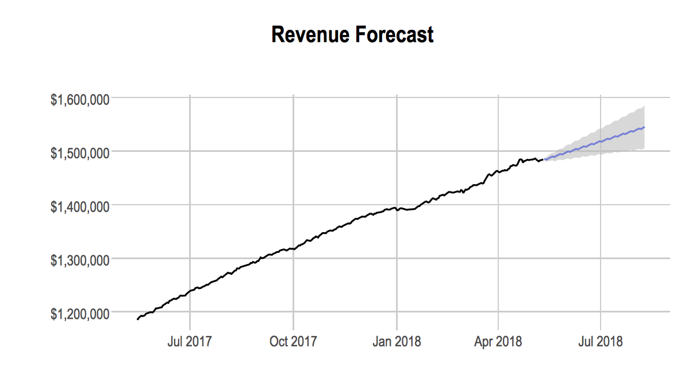

# Revenue Forecaster

[](https://travis-ci.org/bufferapp/mrr-forecaster)

The purpose of this application is to predict what monthly recurring revenue (MRR) will be in the future.

## Methodology

The forecaster works by pulling revenue data in from [this view in Looker](https://looker.buffer.com/looks/4468). The revenue data is aggregated by day and time series object is created.

After the time series object has been created, the forecaster fits an exponential smoothing state space model to the data.

```{r}
# fit exponential smoothing model
etsfit <- ets(ts)
```

The forecast is created from the ETS model with the generic `forecast()` function from Rob J Hyndman's `forecast` package.



The application then writes the model results to Redshift with the `write_to_redshift()` function in the `buffer` package.

## How it Works


To run the application locally, make sure that you have Looker, Redshift, and AWS credentials in your `.env` file. Then you can run the following command.

```
make run
```

## Deployment

This project is configured to run as a Kubernetes cron job running on our Apollo Cluster. Pushing to the master branch on GitHub will deploy to production, using Cloud Build.

If you need to deploy manually, make sure you have `gcloud` installed and your authenticated for the `buffer-data` project. Then you can just run `make deploy`.

Let Julian know if you have any thoughts or questions! Feel free to create issues and submit pull requests. :)
